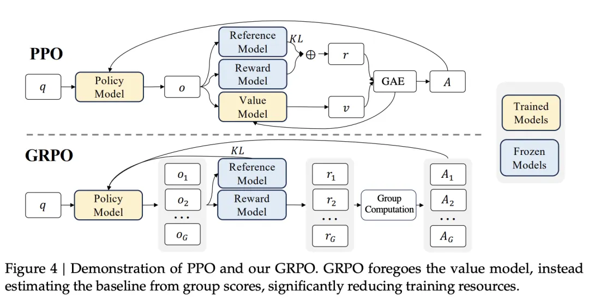

# 17.7 GRPO算法

GRPO是一种去除Critic网络的PPO变体。通过利用LLM强大的并发生成能力，我们可以运用蒙特卡洛方法进行价值的无偏估计，来代替神经网络可能有偏的价值估计，从而大幅降低显存消耗（少一个网络），并保持训练的数学稳定性。

## 一、运用蒙特卡洛方法估计价值

在强化学习中，优势函数 $A(s,a)$ 的定义是：

$$
A(s,a)=Q(s,a)-V(s)
$$

我们来看GRPO是如何计算优势的：

- $Q(s,a)$ 的估计：对于第 $i$ 个采样 $o_i$，其实际获得的奖励 $r_i$ 就是动作价值 $Q(s,a)$ 的单次蒙特卡洛采样（无偏估计）。
- $V(s)$ 的估计：GRPO计算这一组采样的平均值 $\bar{r}=\frac{1}{G}\sum_{j=1}^{G}r_j$。

根据大数定律（Law of Large Numbers），当 $G\to\infty$ 时：

$$
\bar{r}\to \mathbb{E}[R\mid s]=V(s)
$$

所以，GRPO的优势计算公式 $A_i=r_i-\bar{r}$，本质上就是：

$$
\text{Advantage}\approx \text{Sampled }Q(s,a)-\text{Monte Carlo Estimated }V(s)
$$

运用蒙特卡洛方法的好处在于其无偏性。Q网络的更新中，一个状态动作对Q值的偏差会在其他Q值更新时产生影响，很容易导致误差累积，蒙特卡洛方法则无此问题。

如果直接使用MC估计这么好（无偏），为什么PPO还要费力去训练一个Critic神经网络来预测 $V(s)$ 呢？

核心原因在于：方差（Variance）。

传统强化学习的困境是单样本估计。在传统的强化学习中，例如机器人控制、打Atari游戏，通常只能基于当前的 $s$ 采样一条轨迹。

- 如果只采样一次得到 $r$，直接用 $r$ 当作 $Q$，方差极大。
- 如果没有Critic，就需要用历史平均奖励作为Baseline。
- 这会导致训练非常不稳定，收敛缓慢。

PPO采用Actor-Critic解法，引入Critic网络 $V_{\phi}(s)$：

- 优点：降低方差。Critic见过很多类似的状态，它的预测比较平滑稳定。
- 缺点：引入偏差（Bias）。如果Critic没训练好（拟合误差），它给出的Baseline就是错的，会带偏Actor的更新方向，而且显存占用翻倍。

GRPO之所以能成功“复古”回蒙特卡洛方法，是因为它利用了LLM推理的一个独特工程特性：同一个Prompt可以低成本地产生差异结果。

在机器人领域，你很难让机器人“完全一致地”把同一个动作重复做64次来求平均，因为环境不可逆。但在LLM中，可以轻松设置 `num_return_sequences=64`。

GRPO的方差控制术如下。虽然MC估计通常方差大，但GRPO通过以下方式控制住了方差，从而不再需要Critic：

1. Group采样（$G$ 足够大）：它不是用1个样本去估计 $V(s)$，而是用 $G$ 个样本，例如DeepSeek用 $G=64$。根据中心极限定理，样本均值的方差是单样本方差的 $\frac{1}{G}$。通过增大 $G$，直接把MC的方差压下来了。
2. 组内标准化（Group Normalization）：公式 $\frac{r_i-\bar{r}}{\sigma_R}$ 不仅是减去均值，还除以标准差。这相当于对奖励信号做动态缩放（Dynamic Scaling），进一步稳定了梯度的幅度，起到了类似Batch Normalization的作用。

## 二、模型架构与表达式

为了后续推导的严谨性，我们统一使用以下符号：

- $q$：输入的问题（Prompt），采样自分布 $P(Q)$。
- $G$：组的大小（Group Size），即对每个问题采样的输出数量。
- $o_i$：针对同一个 $q$ 采样的第 $i$ 个输出序列，其中 $i\in\{1,\ldots,G\}$。
- $T_i$：第 $i$ 个输出序列 $o_i$ 的长度（Token数量）。
- $o_{i,t}$：序列 $o_i$ 中的第 $t$ 个Token。
- $\pi_{\theta}$：当前待优化的策略模型（Policy Model）。
- $\pi_{\theta_{\mathrm{old}}}$：采样时使用的旧策略模型。
- $\pi_{\mathrm{ref}}$：参考模型（Reference Model，通常是SFT模型），用于KL约束。
- $r_i$：第 $i$ 个输出序列获得的完整奖励（由Reward Model或环境给出）。
- $A_i$：第 $i$ 个输出序列的优势函数（Advantage）。

图中可以看出，PPO需要额外训练Value Model来估计价值基准，而GRPO冻结参考模型并使用组内样本奖励来估计Baseline，因此可以省去Critic网络。

### 1. 群体采样（代替期望计算）

对于每一个输入 $q$，我们使用旧策略 $\pi_{\theta_{\mathrm{old}}}$ 采样一组共 $G$ 个输出：

$$
\{o_1,o_2,\ldots,o_G\}\sim \pi_{\theta_{\mathrm{old}}}(O\mid q)
$$

随后，我们对每个输出计算奖励 $\{r_1,r_2,\ldots,r_G\}$。

### 2. 优势估计

这是GRPO取代Critic网络的关键。传统的A2C/PPO使用神经网络 $V_{\phi}(s)$ 预测基准值，而在GRPO中，我们利用当前这组样本的平均奖励作为基准。

计算第 $i$ 个样本的优势 $A_i$：

$$
A_i=\frac{r_i-\mu_{\mathrm{group}}}{\sigma_{\mathrm{group}}+\epsilon}
$$

其中 $\mu_{\mathrm{group}}$ 表示当前组奖励均值，$\sigma_{\mathrm{group}}$ 表示当前组奖励标准差。

除以标准差是因为考虑到不同类型的问题给分模式不同，可能互相不可比，故将其标准化。但也可能带来问题，比如对于过于难或简单的问题，几乎所有回答得分都一样时，该问题权重会被人为拉大。针对此问题后续已有工程上的优化。

### 3. 目标函数与长度归一化

目标函数 $J(\theta)$ 如下：

$$
\mathcal{J}_{\mathrm{GRPO}}(\theta)=
\mathbb{E}_{q\sim P(Q),\{o_i\}_{i=1}^{G}\sim\pi_{\theta_{\mathrm{old}}}(O\mid q)}
\left[
\frac{1}{G}\sum_{i=1}^{G}\frac{1}{T_i}\sum_{t=1}^{T_i}
\left(
\min(\rho_{i,t}A_i,\mathrm{clip}(\rho_{i,t},1-\epsilon,1+\epsilon)A_i)-\beta D_{\mathrm{KL},t}
\right)
\right]
$$

这里Clip和KL同时存在，二者作用略有不同。Clip限制单次梯度更新的幅度，防止策略在一次迭代中变化过大导致训练崩塌；KL项保证最终策略距离初始参考策略不太远，关注累积效应，保证模型不会为了取得更高Reward而让语言能力退化。

这里 $\rho_{i,t}$ 表示当前策略相对旧策略的概率比，$D_{\mathrm{KL},t}$ 表示当前Token位置的KL惩罚项。对旧策略采样分布求期望后，可以得到策略和参考模型之间的KL约束；这里不需要遍历词表中的所有词，因为遍历通常是为了求期望，而组采样蒙特卡洛已经能近似得到该期望。

之所以用反向KL散度而非前向KL散度，是因为反向KL散度 $KL(\pi_{\theta}\Vert\pi_{\mathrm{ref}})$ 会对当前策略高概率、参考策略低概率的区域给出较大惩罚，进而呈现“模式搜索”行为，让新的概率空间收敛到预训练后概率较大的空间里的特定模式（如果跳出空间往往表现为输出乱码、不符合正常语义的内容等，即“模式崩塌”）；前向KL散度则会倾向于覆盖预训练后的高概率空间，呈现“均值搜索”行为。RL获得的空间往往是预训练的子集（这也可能是RL难以让模型获得预训练完全没见过的技能的原因之一）。

方括号内，对于同一个输入，从第1到第 $G$ 个输出取平均，然后是一个长度归一化项。这个长度归一化项是GRPO的另一个关键。

标准的策略梯度下，我们优化的目标是总奖励的期望：

$$
J=\mathbb{E}_{\tau\sim\pi_{\theta}}[R(\tau)]
$$

其梯度是（忽略Baseline）：

$$
\nabla J\approx \sum_{t=1}^{T}\nabla\log\pi_{\theta}(a_t\mid s_t)\cdot R
$$

目标函数 $J$ 的梯度是对每一个动作的策略计算并累加的。假设 $J$ 对每个动作的梯度大小为1，那么长为100的序列得到的梯度就约为长为10的序列的十倍，这会导致模型被长序列主导更新。但对于同一个问题而言，每个答案序列贡献的梯度应该是“平等”的，故我们需要除以序列长度 $T$：

$$
\nabla J_{\mathrm{GRPO}}\approx \frac{1}{T}\sum_{t=1}^{T}\nabla\log\pi_{\theta}(a_t\mid s_t)\cdot A
$$

但这也会产生一个问题，那就是当我们把 $J$ 的梯度除以 $T$ 时，意味着把目标函数 $J$ 本身也除以了 $T$，目标函数变成了“单位Token能获得的奖励的期望”。这会导致模型在回答错误时生成大量无用的Token。原因在于：

当优势函数为正值时，意味着生成的结果是正确的，目标函数为正。由于目标函数是“单位Token能获得的奖励的期望”（有分母 $T$），为了让目标函数变大，策略在优化过程中会倾向于生成简短的正确答案，即这样的答案会产生比其他答案更大的梯度更新幅度。

当优势函数为负值时，意味着生成的结果是错误的，目标函数为负。为了让目标函数变大（惩罚的绝对值变小），策略会倾向于生成较长的答案（因为目标函数中除以较大 $T$），即这样的答案受到的负向惩罚和梯度压力反而更小。

## 三、优势函数估计的有偏性问题及解决方案

GRPO的优势函数估计看似是无偏的，实则往往对难题低估、对简单题高估。例如，一次取8条路径，对于一道答对概率只有1%的难题，答对奖励为1，答错奖励为0，则8条路径都答错时没有梯度；有一条答对时，答对的那条路径优势函数为 $1-\frac{1}{8}=\frac{7}{8}$，但实际上优势函数为 $1-\frac{1}{100}=\frac{99}{100}$。对于简单题则相反，如答对概率为99%，一条答错，答对者优势函数即为 $\frac{1}{8}$，实际上只有 $\frac{1}{100}$。

对此，可将难题优势函数乘以更大系数，简单题优势函数乘以更小系数，以尽可能实现无偏估计。

## 参考文献

- Shao, Z., Wang, P., Zhu, Q., et al. (2024). [DeepSeekMath: Pushing the Limits of Mathematical Reasoning in Open Language Models](https://arxiv.org/abs/2402.03300). arXiv:2402.03300.
