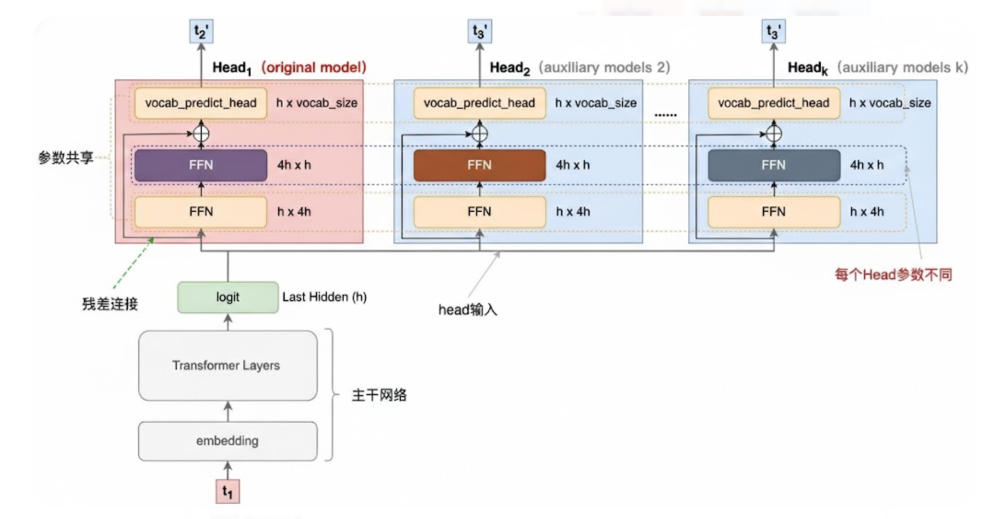
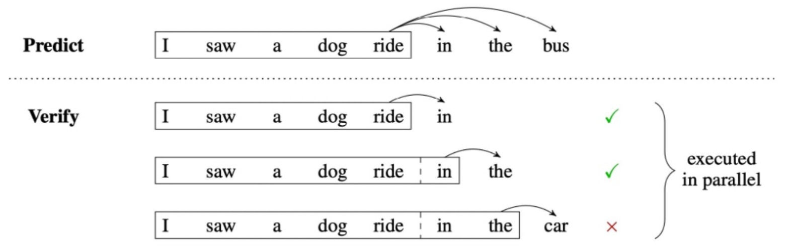
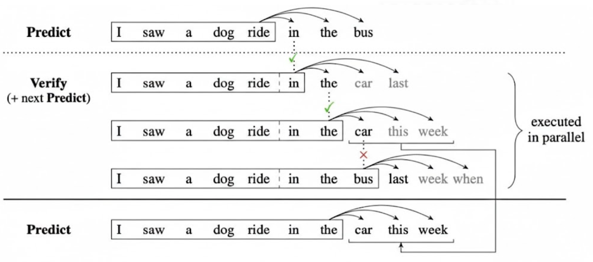
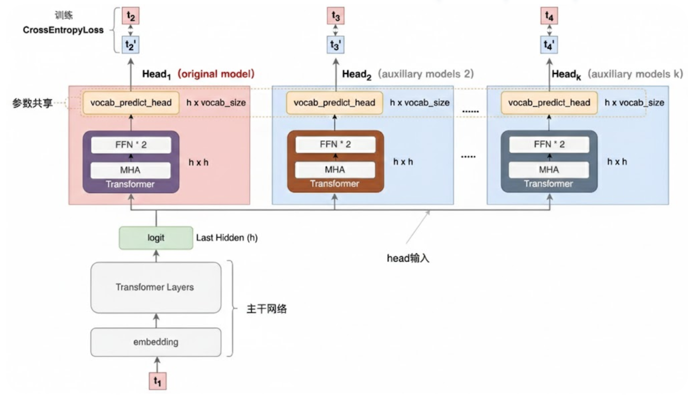
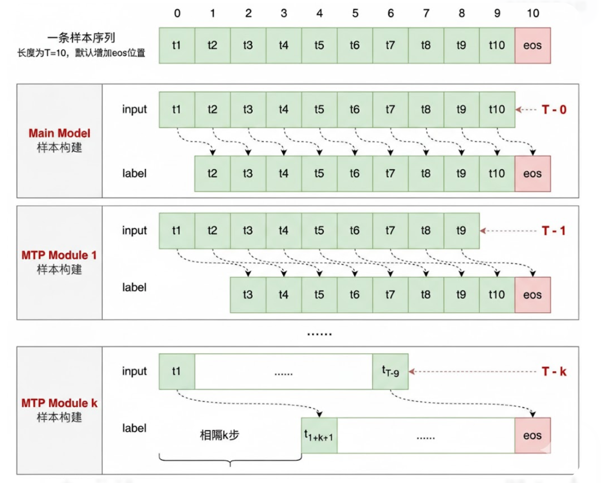
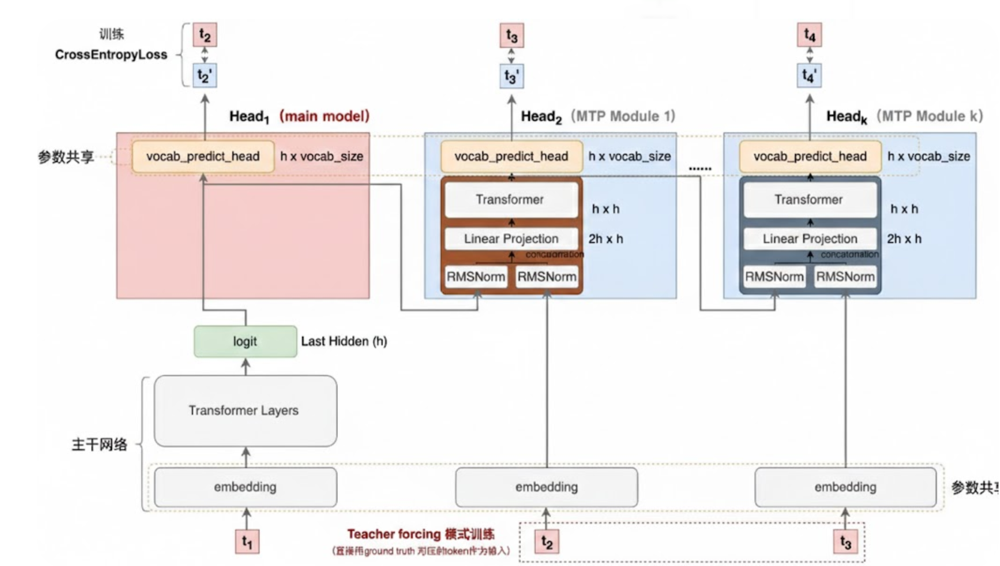
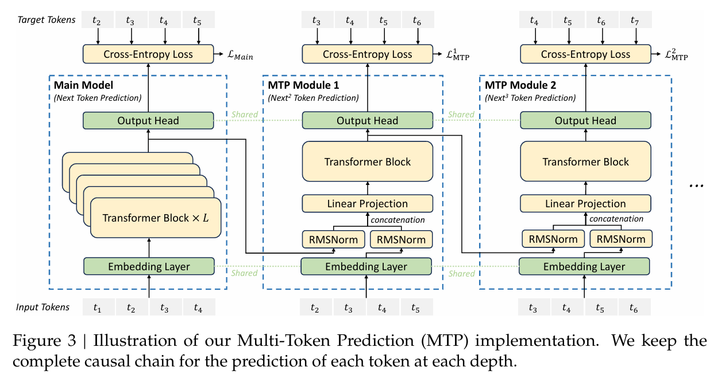

# 20.1 Multi-token Prediction

## 一、Multi-Token Prediction（MTP）的提出背景

由于LLM的推理是自回归的，每次生成一个token，都要在显存中加载一轮完整的模型参数，导致显存带宽成为推理速度的显著瓶颈。同时，在利用Next token prediction进行训练的过程中，模型只能学习基于当前预测下一个token的质量，而无法拥有更远的“视野”。Multi-Token Prediction（MTP）通过在训练和推理中每一次并行生成多个token，来解决这些问题。

## 二、Blockwise Parallel Decoding

这是Google于2018年提出的范式，也是MTP的初始形态。

1. 模型架构

如图，主干网络是训练好的多层decode-only的Transformer网络，经过多层前向计算后，最终隐藏层输出h维度（＝embedding维度）的logit。上面接了多个输出Head，每个Head负责预估一个token。每个Head有三层：首先是一个共享的FFN层，将logit做宽映射（h维->4h维）；然后再过一个非共享的FFN层，将logit维度还原（4h维->h维），经残差连接，得到h维embedding向量。最后，再将结果送入到词表投影层得到每个词的概率分布。

2. 生成范式

MTP的生成过程是一个“Predict-Verify”的循环过程。先一次性预测 $K$ 个 token，然后利用Transformer的并行性，如图通过掩码的方式实现并行验证。如果预测全部正确，相当于用2次推理的时间实现了 $K$ 次推理。

进一步地，重叠第 $n$ 步的 verify 阶段和第 $n+1$ 步的 predict 阶段，能进一步提高推理性能。如图，先预测出 3 个 token，然后在验证阶段，仍然每次都预测 3 个 token。如由于第 2 个正确，可以以其为条件生成第 3 个“car”、第 4 个“this”和第 5 个“week”，由于最初预测的第 3 个对不上，故最初的预测只能留下“in”和“the”，然后这里生成的第 3 到第 5 个 token 就可以直接作为新的一轮预测，后续再验证此时生成的第 4 和第 5 个，以此类推，不需要重新预测 3 个 token。

本质上，这就是利用多token生成的并行性，把后续根据“in”“the”这两个正确的token进行新一轮预测的步骤并入之前的验证步骤。

## 三、Meta's MTP

如图，Meta让每个头不仅仅是FFN层，还有Transformer层，从而可以处理更复杂的序列上下文关系。

## 四、DeepSeek MTP

训练阶段：Main Model：由 $t_1$ 生成 $t_2$；由 $t_1,t_2$ 生成 $t_3$；……；由 $t_1$ 到 $t_{10}$ 生成 eos token；计算平均Cross-Entropy Loss。MTP Model 1：MTP Module：由 $t_1,t_2$ 生成 $t_3$；……；由 $t_1$ 到 $t_9$ 生成 eos token；计算平均Cross-Entropy Loss。后续的MTP Module以此类推。

从模型架构上看，DeepSeek在Meta工作的基础上，还在MTP的Transformer层前加上了额外的输入。这个额外输入在训练时是ground truth的t2和t3，以防止细微误差导致“跑偏”；在推理时则是模型自身预测的t2和t3（虽然运用了上一次预测，但这里并非退化为Next token prediction，因为自身预测的t2和t3只经过轻量级MTP模块，不经过全模型，故仍为MTP）。MTP头的损失：

$$
\mathcal{L}_{\mathrm{MTP}}^k
= \mathrm{CrossEntropy}\left(P^k_{2+k:T+1}, t_{2+k:T+1}\right)
= -\frac{1}{T}\sum_{i=2+k}^{T+1}\log P_i^k[t_i].
$$

DeepSeek原论文中插图如下：

## 参考文献

- Stern, M., Shazeer, N., & Uszkoreit, J. (2018). [Blockwise Parallel Decoding for Deep Autoregressive Models](https://arxiv.org/abs/1811.03115). NeurIPS 2018.
- Gloeckle, F., Idrissi, B. Y., Roziere, B., et al. (2024). [Better & Faster Large Language Models via Multi-token Prediction](https://arxiv.org/abs/2404.19737). ICML 2024.
- DeepSeek-AI. (2024). [DeepSeek-V3 Technical Report](https://arxiv.org/abs/2412.19437). arXiv:2412.19437.
- 姜富春. (2025). [从DeepSeek V3的MTP，解析MTP技术的前世今生](https://zhuanlan.zhihu.com/p/18056041194). 知乎专栏.
